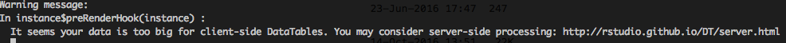
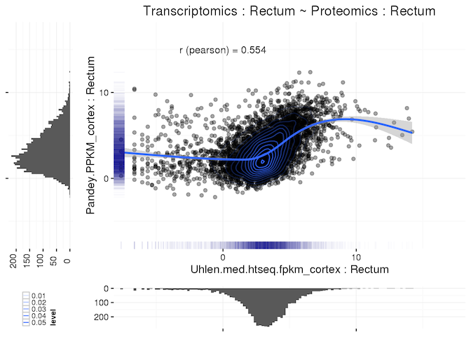
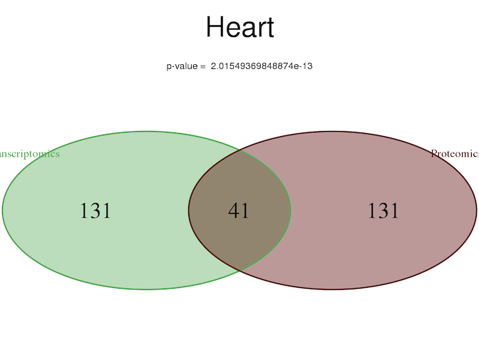

# R-markdown

##

    My most favourite thing with working with R[1] and [2]

    [1] Well, you know, apart of having to code heavy mathematical functions

    [2] And, once you got pandoc running (Thanks Micha !!)


# DT: a Shiny plugin

##
which is not only for shiny app and can be also used in a full client mode and static way

(I still have to found time to learn shiny myself :( )


Example of usage and output with the iris data `r data(iris)`
(kinda work in slides as well)

```{r}
library(DT)
```

```{r}
datatable(iris) #that's it! (for the basic output)
```

##
A couple of example:

* [example](http://www.ebi.ac.uk/~mitra/workspace/Baseline/explore/annotation/M2836_annot.html)

* [example (big)](http://www.ebi.ac.uk/~mitra/workspace/Baseline/explore/plots/TwelveTissues/Pandey.v3_Uhlen.med_cuffFPKM_Gtex.med.med_cuff_FPKM_12T_expression_summary.html)

Big drawback though for the static way: the html page can get very big, very fast:
tsv file: 14MB --> html file: ~ 14MB

common warning 

# gridExtra

##
* Very handy to assemble multiple parts to create one plot
* No need to work with _pushViewport_ or _viewport_
* So far I managed to use it with any of graphical package I wanted


##
Example 1 (created with gridExtra)



(ggplot2 as a base)

##
Example 2 (created with gridExtra)

(vennDiagram as a base)

##

Good tutorial on [Baptiste Augie page](https://github.com/baptiste/gridextra/wiki)

The original tutorial covers the nested layouts as well.

But here a small example:

```{r}
library(grid)
library(gridExtra)
library(ggplot2)
t<-textGrob('A basic example')
p1 <-ggplot(iris,aes(Petal.Length))+geom_histogram()
lay<-rbind(c(1),
           c(2),
           c(2),
           c(2),
           c(2))
```

##
Without polishing:
```{r}
grid.arrange(t,p1)
```

##
With a tiny bit of polishing:
```{r}
grid.arrange(t,p1,layout_matrix=lay)
```


